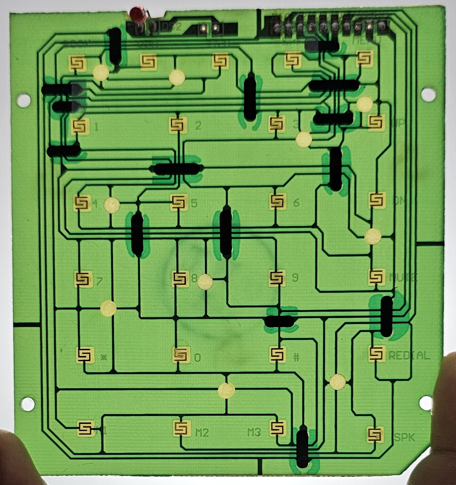

# **Dialഡെക്ക്**  
## Repurposing the Past for the Future!  

**Dialഡെക്ക്** transforms your nostalgic BSNL landline into a cutting-edge stream deck, powered by an ESP 32. With this project, you'll breathe new life into old technology, turning it into a customizable control hub for streamers and content creators. Why let that landline gather dust when it can be the centerpiece of your next creative setup?

## Star History

## **Features**

- **Customizable Buttons**: Each landline button can be programmed for unique functions—switch scenes, mute your mic, or trigger sound effects with a click!  
- **Effortless Setup**: Minimal wiring and a straightforward ESP 32 configuration make it beginner-friendly.  
- **Open-Source & Hackable**: Dive into the code and hardware—add, tweak, or modify as you wish!  

## **What You'll Need**

- Arduino Nano  
- Old BSNL Landline  
- USB Cable  
- Jumper Wires  
- Soldering Kit for a secure connection

## **How to Build Your Dialഡെക്ക്**

1. **Disassemble the Landline**: Crack open the retro case and find those button connections that we’re going to hack into!  
2. **Wiring to ESP 32**: Carefully connect the buttons to the ESP 32 with jumper wires (pin-by-pin instructions in the guide).  
3. **Upload the Code**: Upload the pre-made or custom Arduino code that maps each button to specific stream functions.  
4. **Test, Tweak, Triumph!**: Run your setup through a few tests—make sure each button is smooth and functional.

## **How Does It Work?**

Once everything is up and running, Dialഡെക്ക് becomes your ultimate control panel. You’ll be able to control your stream software—scene switches, audio adjustments, or even launching apps—all at your fingertips.

## **Future Enhancements**

<!-- - **LED Feedback**: Add visual feedback for active buttons with custom LED indicators.   -->
- **LCD Screen**: Integrate a small display to show your stream status or data in real-time.  
- **Wireless Upgrade**: Cut the cords—add Bluetooth or Wi-Fi connectivity for seamless wireless control.  
<!-- - **Custom Housing**: Design and 3D print a slick new enclosure to make your setup look as professional as it is functional. -->

## **Get Involved**

We’re all about collaboration. Fork the repo, share your improvements, and send pull requests! Whether you’re adding new features or refining existing ones, your contributions are welcome.

## **License**

This project is licensed under the MIT License—use it freely, modify it, share it. Let creativity flow!

## **Support & Feedback**

Got a question or hit a snag? Don’t hesitate to open an issue on GitHub or reach out via [email](mailto:rishikrishna.sr@gmail.com). We’re here to help!!

