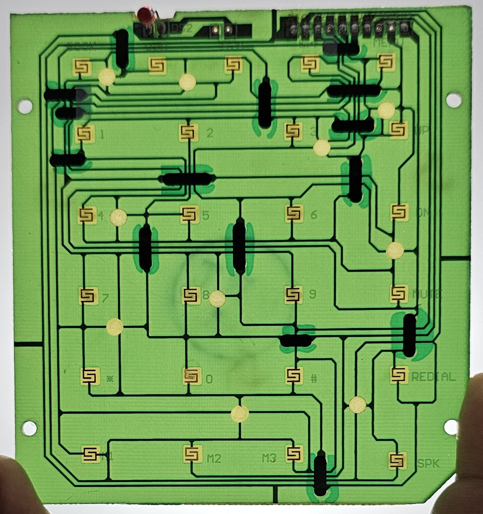

# DialDeck
# DialDeck

DialDeck is a project that transforms an old BSNL landline into a functional stream deck using an Arduino Nano. This project allows you to repurpose outdated technology into a useful tool for streamers and content creators.

## Features

- **Customizable Buttons**: Assign different functions to each button on the landline.
- **Easy Setup**: Simple wiring and coding with Arduino Nano.
- **Open Source**: Modify and improve the project as you see fit.

## Requirements

- Arduino Nano
- Old BSNL Landline
- USB Cable
- Jumper Wires
- Soldering Kit (optional)

## Installation

1. **Disassemble the Landline**: Carefully open the landline and identify the buttons and their connections.
2. **Connect to Arduino**: Use jumper wires to connect the buttons to the Arduino Nano.
3. **Upload Code**: Write and upload the Arduino code to map the buttons to desired functions.
4. **Test and Debug**: Ensure all buttons are functioning as expected.

## Usage

Once set up, you can use the DialDeck to control various aspects of your stream, such as switching scenes, muting the microphone, and more.

## Contributing

Feel free to fork this repository and submit pull requests. Contributions are welcome!

## License

This project is licensed under the MIT License.
## Future Enhancements

- **LED Indicators**: Add LED lights to show the status of each button.
- **LCD Screen**: Integrate a small LCD screen to display information.
- **Wireless Connectivity**: Upgrade to a wireless module for a cleaner setup.
- **Custom Enclosure**: Design and 3D print a custom case for a professional look.

## Support

If you encounter any issues or have questions, feel free to open an issue on GitHub or reach out via [email](mailto:support@example.com).

## Acknowledgements

Special thanks to the open-source community and all contributors who made this project possible.

Stay creative and happy streaming!